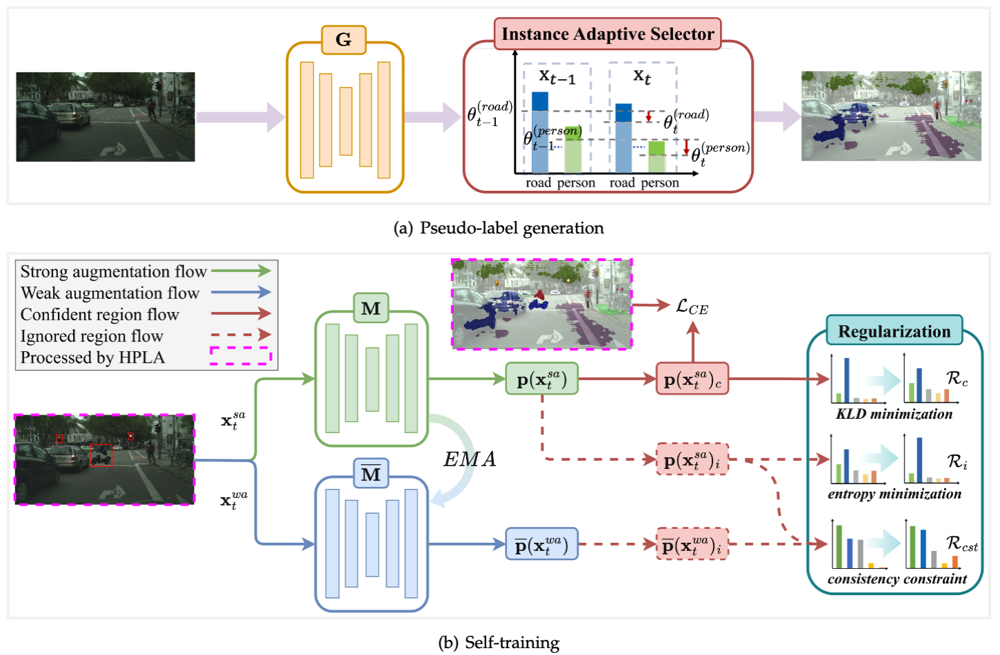

# HIAST: Hard-aware Instance Adaptive Self-training for Unsupervised Cross-domain Semantic Segmentation

**[[TPAMI2025 Paper]](https://arxiv.org/pdf/2302.06992)**

🔔 **News:**

* [2025-03-29] The training code with AdaptSeg as warmup model has been released.
* [2025-03-18] We are happy to announce that HIAST was accepted at **TPAMI2025**.

## Overview

### Introduction

The divergence between labeled training data and unlabeled testing data is a significant challenge for recent deep learning models. Unsupervised domain adaptation (UDA) attempts to solve such problem. Recent works show that self-training is a powerful approach to UDA. However, existing methods have difficulty in balancing the scalability and performance. In this paper, we propose a hard-aware instance adaptive self-training framework for UDA on the task of semantic segmentation. To effectively improve the quality and diversity of pseudo-labels, we develop a novel pseudo-label generation strategy with an instance adaptive selector. We further enrich the hard class pseudo-labels with inter-image information through a skillfully designed hard-aware pseudo-label augmentation. Besides, we propose the region-adaptive regularization to smooth the pseudo-label region and sharpen the non-pseudo-label region. For the non-pseudo-label region, consistency constraint is also constructed to introduce stronger supervision signals during model optimization. Our method is so concise and efficient that it is easy to be generalized to other UDA methods. Experiments on GTA5-to-Cityscapes, SYNTHIA-to-Cityscapes, and Cityscapes-to-Oxford RobotCar demonstrate the superior performance of our approach compared with the state-of-the-art methods.



### Result

|        UDA  Scenarios        | mIoU-19 | mIoU-16 | mIoU-13 | mIoU-9 |
| :---------------------------: | :-----: | :-----: | :-----: | :----: |
|      GTA5-to-Cityscapes      |  56.3  |    -    |    -    |   -   |
|     SYNTHIA-to-Cityscapes     |    -    |  53.5  |  60.3  |   -   |
| Cityscapes-to-Oxford RobotCar |    -    |    -    |    -    |  75.2  |

If you find this project useful in your research, please consider citing:

```
@article{zhu2025hard,
  title={Hard-aware instance adaptive self-training for unsupervised cross-domain semantic segmentation},
  author={Zhu, Chuang and Liu, Kebin and Tang, Wenqi and Mei, Ke and Zou, Jiaqi and Huang, Tiejun},
  journal={IEEE Transactions on Pattern Analysis and Machine Intelligence},
  year={2025},
  publisher={IEEE}
}
```

## Setup

### Environment

1. Create virtual environment with Python 3.7.3

```bash
conda create -n HIAST python=3.7.3
conda activate HIAST
```

2. Install requirements.

```bash
pip install -r requirements.txt
```

3. Install [apex](https://github.com/NVIDIA/apex#linux) for easy mixed precision and distributed training in Pytorch. If you encounter problems, please see this [solution](https://github.com/NVIDIA/apex/issues/802#issuecomment-618699214).

### Dataset

1. Download dataset.
   - GTA5: Download all image and label packages from [here](https://download.visinf.tu-darmstadt.de/data/from_games/).
   - Cityscapes: Download `leftImg8bit_trainvaltest.zip` and `gt_trainvaltest.zip` from [here](https://www.cityscapes-dataset.com/downloads/).
   - SYNTHIA: Download `SYNTHIA-RAND-CITYSCAPES` from [here](http://synthia-dataset.net/downloads/).
   - Oxford RobotCar: Download all image and label packages from [here](https://www.nec-labs.com/~mas/adapt-seg/adapt-seg.html).
2. Extract downloaded files and place them in `data/`, if you have already downloaded before, you can create symlinks for them. The dataset directory should be as follows:

```
HIAST
├── ...
├── data
│   ├── cityscapes
│   │   ├── leftImg8bit
│   │   │   ├── train
│   │   │   ├── val
│   │   ├── gtFine
│   │   │   ├── train
│   │   │   ├── val
│   ├── GTA5
│   │   ├── images
│   │   ├── labels
│   ├── SYNTHIA_RAND_CITYSCAPES
│   │   ├── RAND_CITYSCAPES
│   │   │   ├── RGB
│   │   │   ├── GT
├── ...
```

### Pretrained

#### Warmup Model

We have provided the warmup model files ([pseudo_resume_from.pth](https://huggingface.co/wanderhzz/HIAST/blob/main/gtav-to-cityscapes/AdaptSeg%2BHIAST/pseudo_resume_from.pth) and [resume_from.pth](https://huggingface.co/wanderhzz/HIAST/blob/main/gtav-to-cityscapes/AdaptSeg%2BHIAST/resume_from.pth)) of GTA5-to-Cityscapes. You need to download them and put them in pretrained_models/ for self-training experiments.

#### Final Model

We have also provided the final [model file](https://huggingface.co/wanderhzz/HIAST/blob/main/gtav-to-cityscapes/AdaptSeg%2BHIAST/HIAST_final.pth) of GTA5-to-Cityscapes for evaluation. You can download it to verify the performance.

## Training

```bash
cd code
sh train.sh
```

## Evaluation

```bash
cd code
python validate.py --config_file configs/validate.yaml --resume_from pretrained/HIAST_final.pth --color_mask_dir_path ../outputs
```

## Contact

If you encounter any problems please contact us without hesitation.

- Email: liukebin@bupt.edu.cn, czhu@bupt.edu.cn, tangwenqi@bupt.edu.cn
